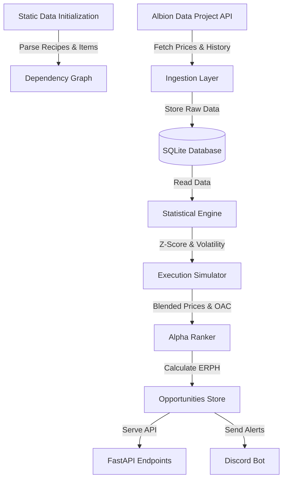

# Albion Quant System (AQS) - Comprehensive Project Description

## 1. Overview
The Albion Quant System (AQS) is an advanced quantitative trading and market-making intelligence engine designed for the MMORPG Albion Online. Moving beyond standard arbitrage bots that merely look for static price differences, AQS models the actual market microstructure, execution slippage, and statistical price regimes to identify "alpha" (profitable opportunities) that survives real-world market conditions.

The system is designed to help players optimize their trading operations, crafting profitability, and cross-city transport routes by providing institutional-grade financial analysis applied to a virtual economy.

---

## 2. System Workflow

The system operates in a continuous cycle or can be triggered via CLI for specific tasks. The general workflow is as follows:

### Key Stages:
1.  **Initialization (`--init`)**: The system parses static game files to understand item relationships, crafting recipes, and city bonuses. This builds the foundational graph used for recursive crafting cost calculations.
2.  **Data Collection (`--collect`)**: A multi-threaded collector pulls real-time prices, order books, and historical data from the Albion Data Project API.
3.  **Scanning & Analysis (`--scan`)**:
    *   **Statistical Analysis**: Calculates mean, variance, and Z-scores to detect market manipulation (pumps/dumps).
    *   **Execution Simulation**: Blends top-of-book prices to account for spread and calculates fill probabilities.
    *   **Scoring**: Computes the Expected Realized Profit per Hour (ERPH) for both arbitrage and crafting.
4.  **Actionable Output**: Results are stored in the database, exposed via a FastAPI REST interface, and broadcasted to Discord for real-time alerts.

---

## 3. Mathematical Models & Calculations

AQS relies on several mathematical models to evaluate opportunities realistically.

### 3.1 Blended Execution Price (BEP)
To prevent relying on thin liquidity at the very top of the order book, AQS calculates a realistic execution price by blending the minimum sell price and maximum buy price.
*   **Standard Spread**:
    $$BEP = (Sell_{Min} \times 0.7) + (Buy_{Max} \times 0.3)$$
*   **Wide Spread** (If spread > 50%):
    $$BEP = (Sell_{Min} \times 0.4) + (Buy_{Max} \times 0.6)$$
*This ensures that calculations are conservative and reflect the likely average price a trader will achieve.*

### 3.2 Resource Return Rate (RRR)
Albion Online rewards crafting in specific cities or using "Focus" with a percentage of materials returned. AQS calculates the effective return rate using the verified game formula:
$$RRR = 1 - \frac{1}{1 + \frac{ProductionBonus}{100}}$$
Where $ProductionBonus$ is the sum of:
*   Base City Bonus (e.g., 18%)
*   Activity Specialization (Refining or Crafting in the correct city)
*   Focus Usage Bonus
*   Daily Event Bonuses

### 3.3 Regime Detection (Z-Score)
To avoid falling into "pumps" or manipulated markets, the system calculates the statistical distance of the current price from the historical mean:
$$Z = \frac{P_{current} - \mu_{history}}{\sigma_{history}}$$
*   **$|Z| > 2.5$**: Classified as **Adversarial Regime** (Manipulation). Scores are penalized heavily (e.g., by 85%).
*   **$1.5 < |Z| < 2.5$**: Classified as **Volatile Regime**. Scores are penalized moderately (e.g., by 40%).

### 3.4 Expected Realized Profit per Hour (ERPH)
The core metric used to rank opportunities. It combines profit, volume, and confidence into a single unit-based expected value.
$$ERPH = (NetProfit \times FillProbability \times Confidence) - TransportCost$$
Where:
*   **Fill Probability**: Estimated based on daily volume and margin percentage. High margins or low volumes decrease probability.
*   **Confidence**: A composite score of data freshness (exponential decay), volume support, and market stability.
*   **Transport Cost**: Calculated as $Distance \times Weight \times Rate \times RiskMultiplier$.

---

## 4. Code Structure & Key Components

The codebase is organized as a modern Python application with a clear separation of concerns:

### 4.1 Core Components
*   **`app/core/scoring.py`**: Contains the `Scorer` class implementing the `ERPH` calculations and confidence scoring.
*   **`app/core/market_utils.py`**: Implements the RRR calculations, price blending, and Z-score logic.
*   **`app/core/constants.py`**: Stores game mechanics data like city bonuses, distance maps, and tax rates.

### 4.2 Application Logic
*   **`app/arbitrage/scanner.py`**: The engine that pulls market data, applies the scoring models, and identifies cross-city trading opportunities.
*   **`app/crafting/`**: Modules dedicated to optimizing multi-step crafting operations to find the cheapest path to produce items.
*   **`app/ingestion/`**: Handles the interface with external data sources.

### 4.3 Interface
*   **`main.py`**: The entry point. It hosts the FastAPI server and provides CLI hooks for manual operations (`--init`, `--collect`, `--scan`).
*   **`app/api/`**: Defines REST endpoints for interacting with the system programmatically.
*   **`app/alerts/`**: Contains the Discord bot logic for sending push notifications of high-value opportunities.

---

*Note: This document was generated based on the current implementation of the AQS codebase (v3.1+).*
